# CRM客户管理系统
## 1、项目介绍

CRM系统即客户关系管理系统， 顾名思义就是管理公司与客户之间的关系。 是一种以"客户关系一对一理论"为基础，旨在改善企业与客户之间关系的新型管理机制。客户关系管理的定义是：企业为提高核心竞争力，利用相应的信息技术以及互联网技术来协调企业与顾客间在销售、营销和服务上的交互，  从而提升其管理方式，向客户提供创新式的个性化的客户交互和服务的过程。 其最终目标是吸引新客户、保留老客户以及将已有客户转为忠实客户，增加公司市场份额。

CRM 的实施目标就是通过全面提升企业业务流程的管理来降低企业成本，通过提供更快速和周到的优质服务来吸引和保持更多的客户。作为一种新型管理机制，CRM极大地改善了企业与客户之间的关系，应用于企业的市场营销、销售、服务与技术支持等与客户相关的领域。

## 2、项目技术栈

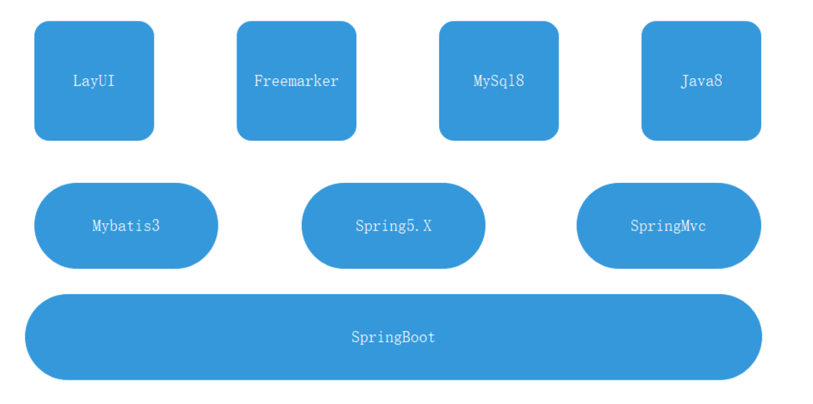

**前端技术栈：**

1. LayUI
2. z-Tree
3. Freemarker

**后端技术栈：**

1. Spring Boot
2. Spring
3. Mybatis
4. SpringMVC
5. MySql
6. Maven
7. JDK8
8. 权限管理

## 3、项目效果图

**主界面**

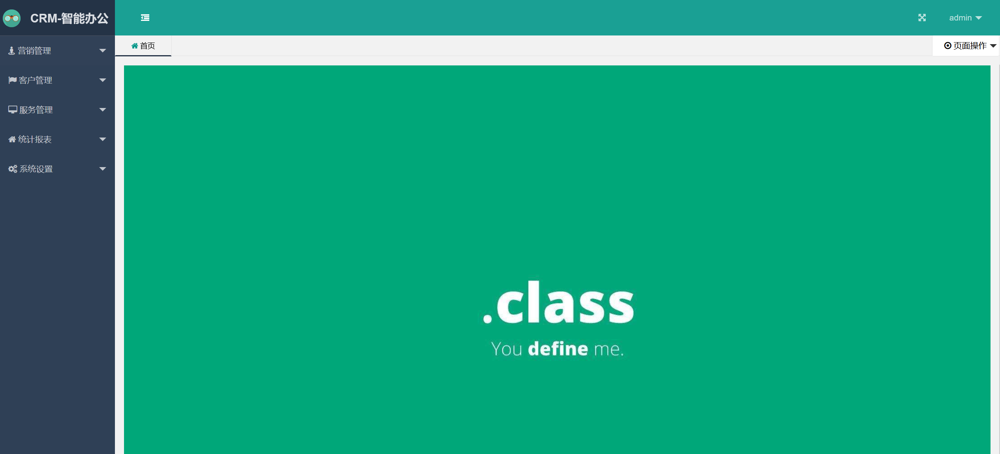

**营销管理**

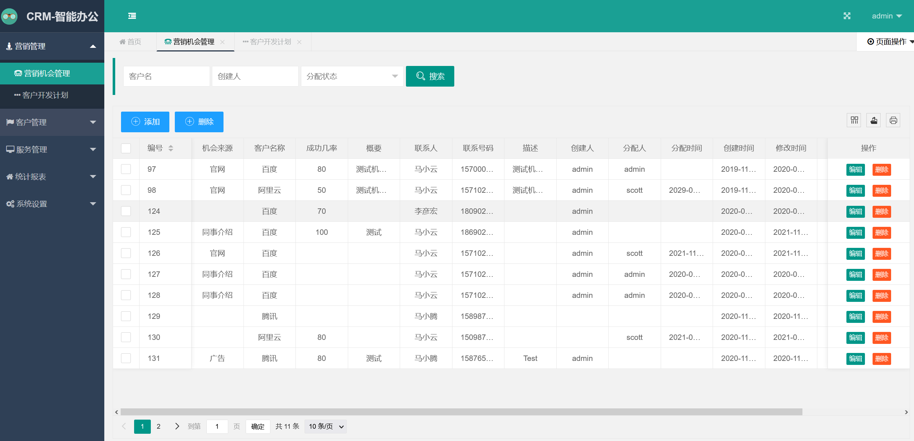

**客户管理** 

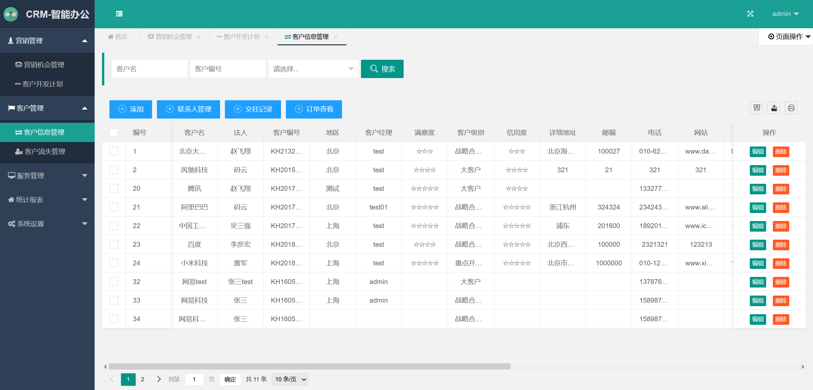

**服务管理** 

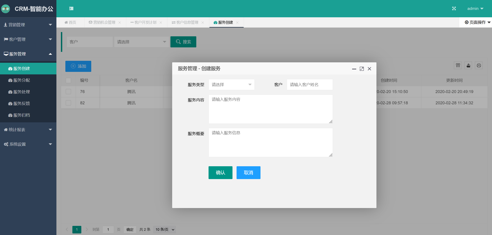

**统计报表**

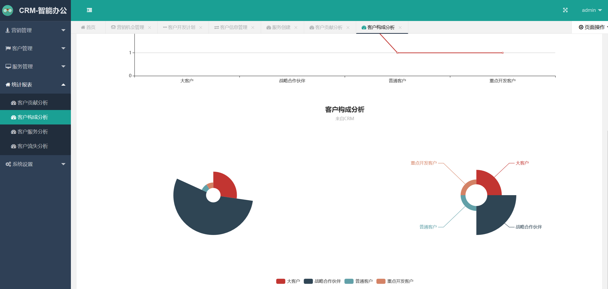

**系统设置** 

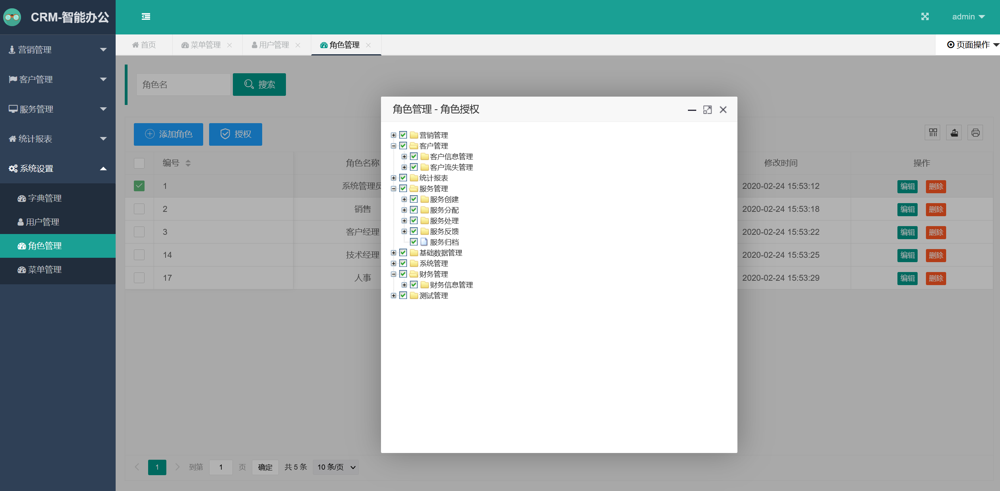

## 3、**CRM** 系统模块划分

### 3.1、**系统功能模块图**

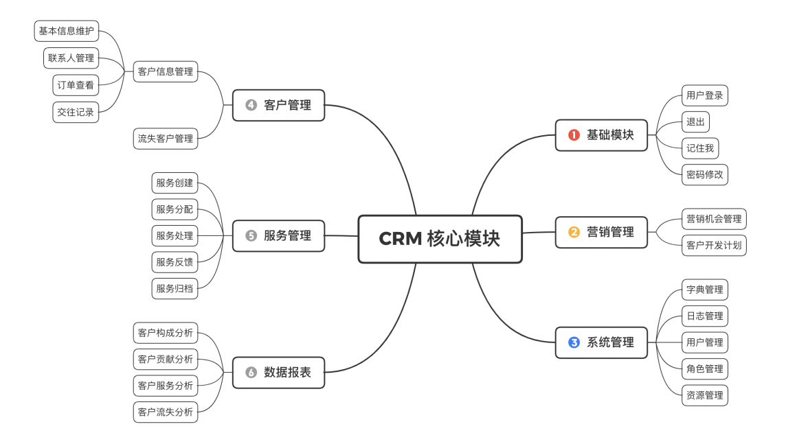

### 3.2、模块功能描述

#### 3.2.1、基础模块

包含系统基本的用户登录，退出，记住我，密码修改等基本操作。

#### 3.2.2、营销管理 

营销机会管理 ：企业客户的质询需求所建立的信息录入功能，方便销售人员进行后续的客户需求跟踪。

营销开发计划 ：开发计划是根据营销机会而来，对于企业质询的客户，会有相应的销售人员对于该客户进行具体的沟通交流，此时对于整个 Crm 系统而言，通过营销开发计划来进行相应的信息管理，提高客户的购买企业产品的可能性。

#### 3.2.3、客户管理

客户信息管理 ：Crm 系统中完整记录客户信息来源的数据、企业与客户交往、客户订单查询等信息录入功能，方便企业与客户进行相应的信息交流与后续合作。

客户流失管理 ：Crm 通过一定规则机制所定义的流失客户（无效客户），通过该规则可以有效管理客户信息资源，提高营销开发的效率。

#### 3.2.4、服务管理

服务管理是针对客户而开发的功能，针对客户要求，Crm 提供客户相应的信息质询，反馈与投诉功能，提高企业对于客户的服务质量。

#### 3.2.5、数据报表

Crm 提供的数据报表功能能够帮助企业了解客户整体分布，了解客户开发结果整体信息，从而帮助企业整体调整客户开发计划，提高企业的在市场中的竞争力度。

#### 3.2.6、系统管理

系统管理包含常量字典维护工作，以及权限管理模块，Crm 权限管理是基于角色的一种权限控制，基于RBAC 实现基于角色的权限控制，通过不同角色的用户登录该系统后展示系统不同的操作功能，从而达到对不同角色完成不同操作功能。

## 4、CRM 系统数据库设计

CRM 系统确定产品的原型稿以及UI组的设计稿，接下来就要设计数据库， 一般在大公司通常会有专门的DBA， 这时我们可以不要考虑数据库表设计， 但是也要能够读懂或者了解DBA的设计思路，方便在程序开发阶段不会出现问题，一般关系型数据库表设计满足三范式的设计即可，表名设计做到见名知意最好。

### 4.1、E-R图表简

#### 4.1.1、营销管理模块

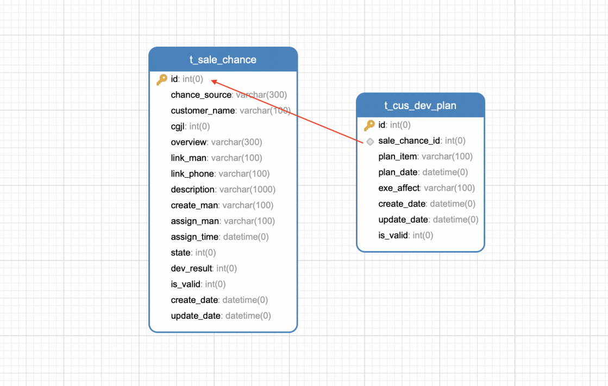

#### 4.1.2、客户管理模块

**客户信息管理**

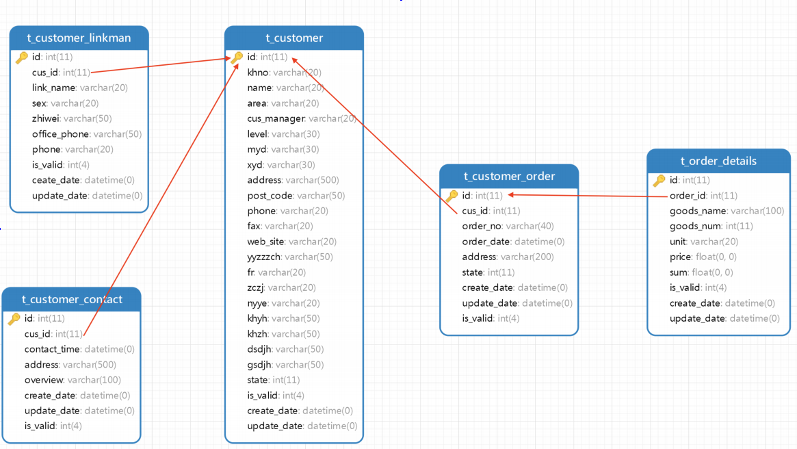

### 4.2、服务管理

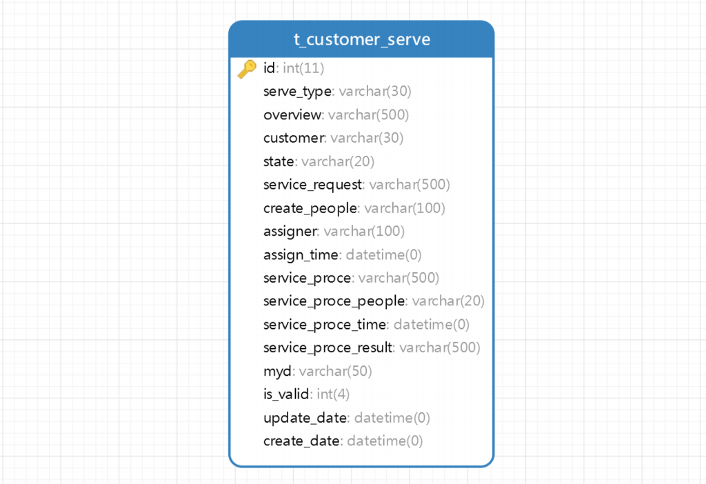

### 4.3、系统管理

#### 4.3.1、权限模块E-R 模型

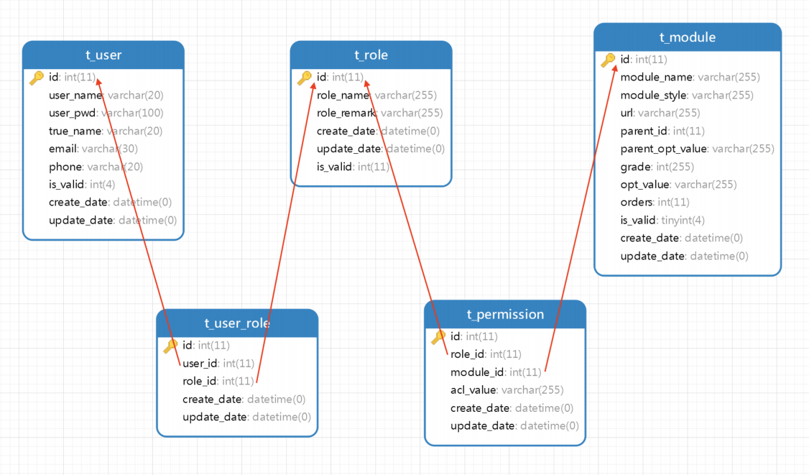

#### 4.3.2、字典&日志管理

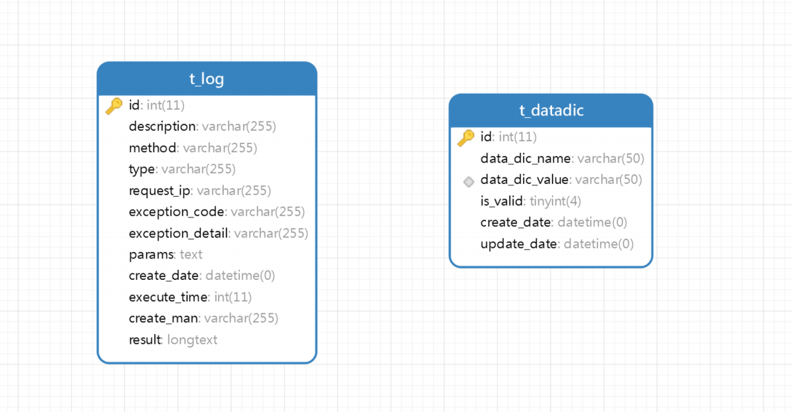

### 4.4、表结构详情

| **t_sale_chance** | **营销机会表** |               |          |          |
| ----------------- | -------------- | ------------- | -------- | -------- |
|                   | 字段           | 字段类型      | 字段限制 | 字段描述 |
| 主键              | id             | int(11)       | 自增     | id主键   |
|                   | chance_source  | varchar(300)  | 可空     | 机会来源 |
|                   | customer_name  | varchar(100)  | 可空     | 客户名称 |
|                   | cgjl           | int(11)       | 可空     | 成功几率 |
|                   | overview       | varchar(300)  | 可空     | 概要     |
|                   | link_man       | varchar(100)  | 可空     | 联系人   |
|                   | link_phone     | varchar(100)  | 可空     | 手机号   |
|                   | description    | varchar(1000) | 可空     | 描述     |
|                   | create_man     | varchar(100)  | 可空     | 创建人   |
|                   | assign_man     | varchar(100)  | 可空     | 分配人   |
|                   | assign_time    | datetime      | 可空     | 分配时间 |
|                   | state          | int(11)       | 可空     | 分配状态 |
|                   | dev_result     | int(11)       | 可空     | 开发结果 |
|                   | is_valid       | int(4)        | 可空     | 有效状态 |
|                   | create_date    | datetime      | 可空     | 创建时间 |
|                   | update_date    | datetime      | 可空     | 更新时间 |

| **t_cus_dev_plan** | **客户开发计划表** |              |          |            |
| ------------------ | ------------------ | ------------ | -------- | ---------- |
|                    | 字段               | 字段类型     | 字段限制 | 字段描述   |
| 主键               | id                 | int(11)      | 自增     | id         |
|                    | sale_chance_id     | int(11)      | 可空     | 营销机会id |
|                    | plan_item          | varchar(100) | 可空     | 计划内容   |
|                    | plan_date          | datetime     | 可空     | 计划日期   |
|                    | exe_affect         | varchar(100) | 可空     | 执行效果   |
|                    | create_date        | datetime     | 可空     | 创建时间   |
|                    | update_date        | datetime     | 可空     | 更新时间   |
|                    | is_valid           | int(4)       | 可空     | 有效状态   |

| **t_customer** | **客户信息表** |              |          |                |
| -------------- | -------------- | ------------ | -------- | -------------- |
|                | 字段           | 字段类型     | 字段限制 | 字段描述       |
| 主键           | id             | int(11)      | 自增     | id主键         |
|                | khno           | varchar(20)  | 可空     | 客户编号       |
|                | name           | varchar(20)  | 可空     | 客户姓名       |
|                | area           | varchar(20)  | 可空     | 客户所属地区   |
|                | cus_manager    | varchar(20)  | 可空     | 客户经理       |
|                | level          | varchar(30)  | 可空     | 客户级别       |
|                | myd            | varchar(30)  | 可空     | 客户满意度     |
|                | xyd            | varchar(30)  | 可空     | 客户信用度     |
|                | address        | varchar(500) | 可空     | 客户地址       |
|                | post_code      | varchar(50)  | 可空     | 邮编           |
|                | phone          | varchar(20)  | 可空     | 联系电话       |
|                | fax            | varchar(20)  | 可空     | 传真           |
|                | web_site       | varchar(20)  | 可空     | 网址           |
|                | yyzzzch        | varchar(50)  | 可空     | 营业执照注册号 |
|                | fr             | varchar(20)  | 可空     | 法人代表       |
|                | zczj           | varchar(20)  | 可空     | 注册资金       |
|                | nyye           | varchar(20)  | 可空     | 年营业额       |
|                | khyh           | varchar(50)  | 可空     | 开户银行       |
|                | khzh           | varchar(50)  | 可空     | 开户账号       |
|                | dsdjh          | varchar(50)  | 可空     | 地税登记号     |
|                | gsdjh          | varchar(50)  | 可空     | 国税登记号     |
|                | state          | int(11)      | 可空     | 流失状态       |
|                | is_valid       | int(4)       | 可空     | 有效状态       |
|                | create_date    | datetime     | 可空     | 创建时间       |
|                | update_date    | datetime     | 可空     | 更新时间       |

| **t_customer_contact** | **客户交往记录表** |              |          |          |
| ---------------------- | ------------------ | ------------ | -------- | -------- |
|                        | 字段               | 字段类型     | 字段限制 | 字段描述 |
| 主键                   | id                 | int(11)      | 自增     | id主键   |
|                        | cus_id             | int(11)      | 可空     | 客户id   |
|                        | contact_time       | datetime     | 可空     | 交往时间 |
|                        | address            | varchar(500) | 可空     | 交往地址 |
|                        | overview           | varchar(100) | 可空     | 概要     |
|                        | create_date        | datetime     | 可空     | 创建时间 |
|                        | update_date        | datetime     | 可空     | 更新时间 |
|                        | is_valid           | int(4)       | 可空     | 有效状态 |

| **t_customer_linkman** | **客户联系人表** |             |          |            |
| ---------------------- | ---------------- | ----------- | -------- | ---------- |
|                        | 字段             | 字段类型    | 字段限制 | 字段描述   |
| 主键                   | id               | int(11)     | 自增     | id主键     |
|                        | cus_id           | int(11)     | 可空     | 客户id     |
|                        | link_name        | varchar(20) | 可空     | 联系人姓名 |
|                        | sex              | varchar(20) | 可空     | 性别       |
|                        | zhiwei           | varchar(50) | 可空     | 职位       |
|                        | office_phone     | varchar(50) | 可空     | 办公电话   |
|                        | phone            | varchar(20) | 可空     | 手机号     |
|                        | is_valid         | int(4)      | 可空     | 有效状态   |
|                        | create_date      | datetime    | 可空     | 创建时间   |
|                        | update_date      | datetime    | 可空     | 更新时间   |

| **t_customer_loss** | **客户流失表**    |               |          |              |
| ------------------- | ----------------- | ------------- | -------- | ------------ |
|                     | 字段              | 字段类型      | 字段限制 | 字段描述     |
| 主键                | id                | int(11)       | 自增     | id主键       |
|                     | cus_no            | varchar(40)   | 可空     | 客户编号     |
|                     | cus_name          | varchar(20)   | 可空     | 客户姓名     |
|                     | cus_manager       | varchar(20)   | 可空     | 客户经理     |
|                     | last_order_time   | date          | 可空     | 最后下单时间 |
|                     | confirm_loss_time | date          | 可空     | 确认流失时间 |
|                     | state             | int(11)       | 可空     | 流失状态     |
|                     | loss_reason       | varchar(1000) | 可空     | 流失原因     |
|                     | is_valid          | tinyint(4)    | 可空     | 有效状态     |
|                     | create_date       | datetime      | 可空     | 创建时间     |
|                     | update_date       | datetime      | 可空     | 更新时间     |

| **t_customer_order** | **客户订单** |              |          |          |
| -------------------- | ------------ | ------------ | -------- | -------- |
|                      | 字段         | 字段类型     | 字段限制 | 字段描述 |
| 主键                 | id           | int(11)      | 自增     | id主键   |
|                      | cus_id       | int(11)      | 可空     | 客户id   |
|                      | order_no     | varchar(40)  | 可空     | 订单编号 |
|                      | order_date   | datetime     | 可空     | 下单时间 |
|                      | address      | varchar(200) | 可空     | 地址     |
|                      | state        | int(11)      | 可空     | 状态     |
|                      | create_date  | datetime     | 可空     | 创建时间 |
|                      | update_date  | datetime     | 可空     | 更新时间 |
|                      | is_valid     | int(4)       | 可空     | 有效状态 |

| **t_order_details** | **订单详情表** |              |          |          |
| ------------------- | -------------- | ------------ | -------- | -------- |
|                     | 字段           | 字段类型     | 字段限制 | 字段描述 |
| 主键                | id             | int(11)      | 自增     | id主键   |
|                     | order_id       | int(11)      | 可空     | 订单id   |
|                     | goods_name     | varchar(100) | 可空     | 商品名称 |
|                     | goods_num      | int(11)      | 可空     | 商品数量 |
|                     | unit           | varchar(20)  | 可空     | 商品单位 |
|                     | price          | float        | 可空     | 单价     |
|                     | sum            | float        | 可空     | 总金额   |
|                     | is_valid       | int(4)       | 可空     | 有效状态 |
|                     | create_date    | datetime     | 可空     | 创建时间 |
|                     | update_date    | datetime     | 可空     | 更新时间 |

| **t_customer_serve** | **客户服务表**       |              |          |              |
| -------------------- | -------------------- | ------------ | -------- | ------------ |
|                      | 字段                 | 字段类型     | 字段限制 | 字段描述     |
| 主键                 | id                   | int(11)      | 自增     | id主键       |
|                      | serve_type           | varchar(30)  | 可空     | 服务类型     |
|                      | overview             | varchar(500) | 可空     | 概要         |
|                      | customer             | varchar(30)  | 可空     | 客户         |
|                      | state                | varchar(20)  | 可空     | 服务状态     |
|                      | service_request      | varchar(500) | 可空     | 服务请求     |
|                      | create_people        | varchar(100) | 可空     | 服务创建人   |
|                      | assigner             | varchar(100) | 可空     | 服务分配人   |
|                      | assign_time          | datetime     | 可空     | 分配时间     |
|                      | service_proce        | varchar(500) | 可空     | 服务处理     |
|                      | service_proce_people | varchar(20)  | 可空     | 服务处理人   |
|                      | service_proce_time   | datetime     | 可空     | 服务处理时间 |
|                      | service_proce_result | varchar(500) | 可空     | 处理结果     |
|                      | myd                  | varchar(50)  | 可空     | 满意度       |
|                      | is_valid             | int(4)       | 可空     | 是否有效     |
|                      | update_date          | datetime     | 可空     | 更新时间     |
|                      | create_date          | datetime     | 可空     | 创建时间     |

| **t_datadic** | **字典表**     |             |          |          |
| ------------- | -------------- | ----------- | -------- | -------- |
|               | 字段           | 字段类型    | 字段限制 | 字段描述 |
| 主键          | id             | int(11)     | 自增     | id主键   |
|               | data_dic_name  | varchar(50) | 可空     | 字典名   |
|               | data_dic_value | varchar(50) | 可空     | 字典值   |
|               | is_valid       | tinyint(4)  | 可空     | 是否有效 |
|               | create_date    | datetime    | 可空     | 创建时间 |
|               | update_date    | datetime    | 可空     | 更新时间 |

| **t_user** | **用户表**  |              |          |          |
| ---------- | ----------- | ------------ | -------- | -------- |
|            | 字段        | 字段类型     | 字段限制 | 字段描述 |
| 主键       | id          | int(11)      | 自增     | 字段描述 |
|            | user_name   | varchar(20)  | 可空     | 用户名   |
|            | user_pwd    | varchar(100) | 可空     | 用户密码 |
|            | true_name   | varchar(20)  | 可空     | 真实姓名 |
|            | email       | varchar(30)  | 可空     | 邮箱     |
|            | phone       | varchar(20)  | 可空     | 电话     |
|            | is_valid    | int(4)       | 可空     | 有效状态 |
|            | create_date | datetime     | 可空     | 创建时间 |
|            | update_date | datetime     | 可空     | 更新时间 |

| **t_role** | **角色表**    |              |          |          |
| ---------- | ------------- | ------------ | -------- | -------- |
|            | 字段          | 字段类型     | 字段限制 | 字段描述 |
| 主键       | id            | int(11)      | 自增     |          |
|            | role_name     | varchar(255) | 可空     | 角色名   |
|            | role_remarker | varchar(255) | 可空     | 角色备注 |
|            | create_date   | datetime     | 可空     | 创建时间 |
|            | update_date   | datetime     |          | 更新时间 |
|            | is_valid      | int(11)      | 非空     | 是否有效 |

